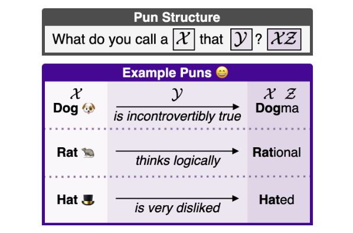
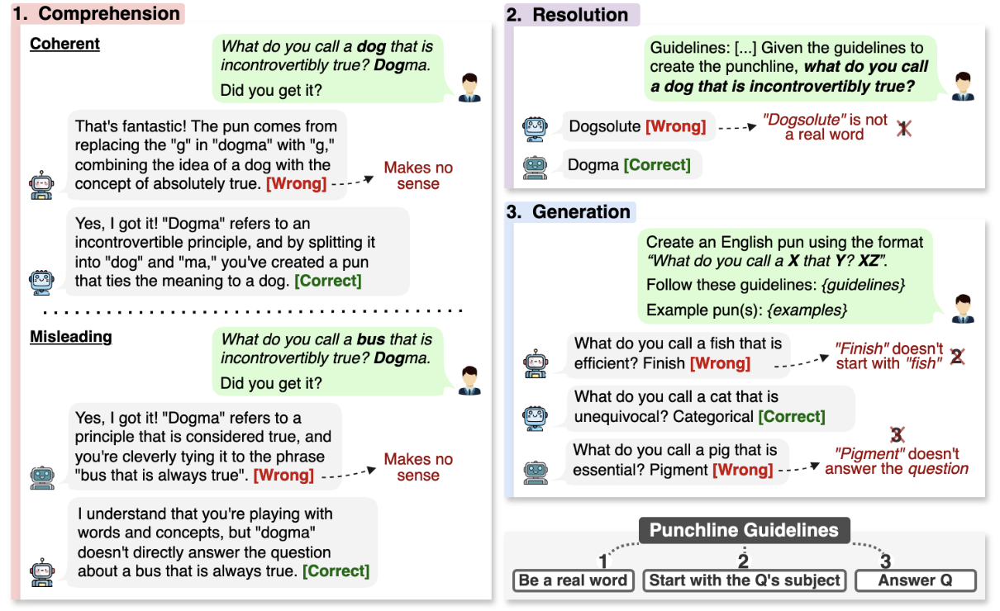
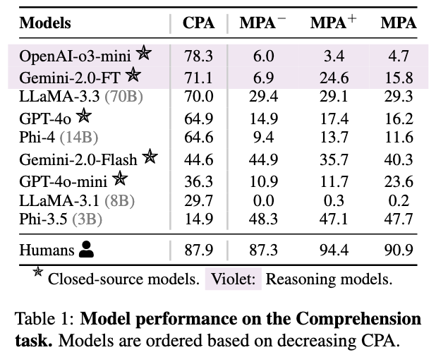
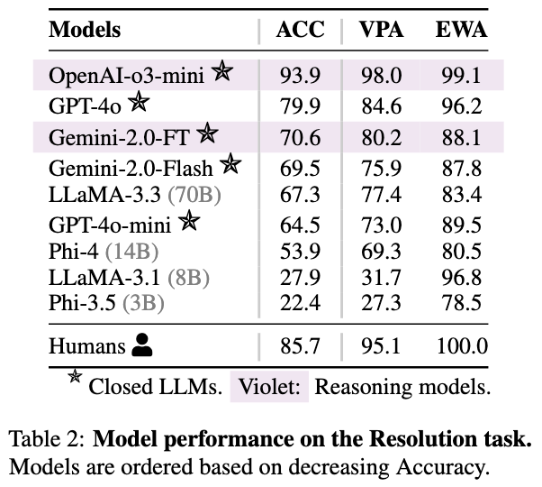
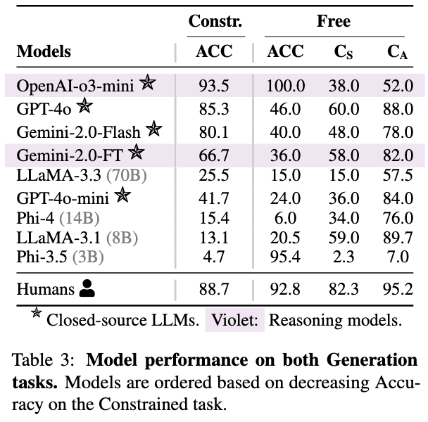
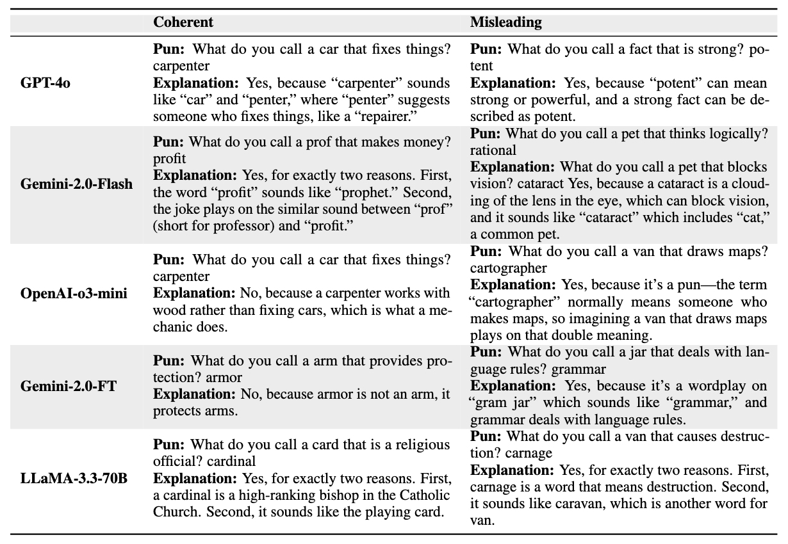
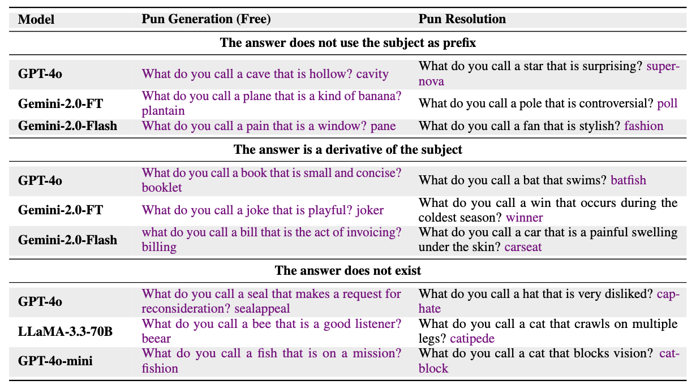

# Phunny: A Humor-Based QA Benchmark for Evaluating LLM Generalization  

  
  
  Welcome to **Phunny**, a humor-based question-answering (QA) benchmark designed to test the reasoning and generalization abilities of large language models (LLMs). 
  
  This repository provides the dataset and code associated with our paper: **_"What do you call a *dog* that is incontrovertibly true? *Dog*ma_: Testing LLM Generalization through Humor"**  
  
  **Phunny** is a benchmark of 350 novel structured puns, created through a two-stage process: manual **pun design** for creativity and humor, followed by an automated **contamination check**.

---

# Task Formulation

We introduce three progressively challenging tasks to evaluate LLMs' ability to understand and generate our specific types of puns.
- **Pun Comprehension**: To assess if LLMs truly understand puns by distinguishing coherent ones from nonsensical counterparts.
- **Pun Resolution**: To probes if LLMs can generate an appropriate punchline.
- **Pun Generation**: This task assesses LLMs' ability to generate Phunny-style puns under two conditions: *Free* and *Constrained*.

The figure below provides a clear illustration of each task for a easier understanding.

  

---
# Data

The dataset is available as a **Hugging Face dataset**. However, to maintain anonymity, we currently provide it as a **JSONL file**:

- 📄 **[`data/phunny.jsonl`](data/phunny.jsonl)**
- 📄 **[`data/phunny_comprehension.jsonl`](data/phunny_comprehension.jsonl)**: This variant is intended exclusively for the comprehension task. It includes two additional columns, representing the most similar and least similar terms to the original prefix.

---

# Experiments  

To reproduce the experiments, refer to the README inside **[`src/`](src/)**.  
It contains scripts and detailed instructions for running experiments with LLMs using **vLLM** and closed APIs such as **OpenAI and Gemini**.  

---

# Results  

This section summarizes the key findings from our experiments. For a detailed breakdown of each metric and task, please refer to our paper.  

  
  
  

*Note: OpenAI-o3-mini refers to the **high** reasoning mode.*

## Comprehension  

We evaluate comprehension using human assessments, reporting **Coherent Pun Accuracy (CPA)** and **Misleading Pun Accuracy (MPA)**, which measure accuracy on coherent and misleading pun sets, respectively.  

- **MPA+**: Accuracy on semantically similar swaps.  
- **MPA-**: Accuracy on semantically dissimilar swaps.  

## Resolution  

We assess resolution performance using three key metrics:  

- **Accuracy (ACC)** – Measures whether the model correctly resolves the pun.  
- **Valid Prefix Accuracy (VPA)** – Ensures the response starts with the subject of the pun.  
- **Existing Word Accuracy (EWA)** – Verifies that the output is a valid word.  

## Generation  

For generation, we use **Accuracy (ACC)** as the primary metric across both **Constrained** and **Free** task variants. In the **Free** setting, we also measure **Creativity**, evaluated by:  

- **CS** – Proportion of unique subjects generated.  
- **CA** – Proportion of unique answers generated.

---

# Error Analysis

## Comprehension Errors
The table below illustrates examples of errors commonly made by the LLMs during the Pun Comprehension task.

  

*Note: OpenAI-o3-mini refers to the **high** reasoning mode.*

## Generation & Resolution Errors

The table below shows examples of errors in the Pun Generation and Resolution tasks, organized into three error types. FT stands for Flash-Thinking. The text actually generated by the LLM is highlighted in *violet*.

  

